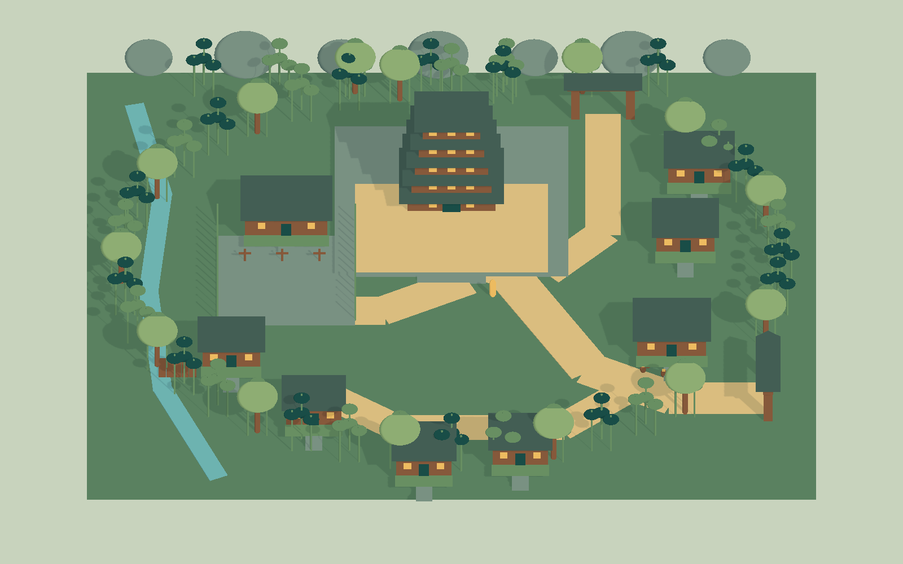

# Unity CLI 地图构图样板与验证

日期：2026-10-02。阶段：**LOCAL ART STUDY**。

## 当前客户端观察

通过 Unity CLI 连接 `client/unity/InsectSpaceClient`，Editor 为 Unity 6000.6.3f1。开始检查时打开 `Assets/InsectSpace/Scenes/SkyShowcase.unity`，已保存且未进入 Play；使用 URP-HighFidelity。`Sky Showcase Camera` 是透视相机，位置约 `(0, 6.73, -15.55)`，俯角约14.29°；不能将其描述成现成的45°地图机位。

实际相机截图：`client/unity/InsectSpaceClient/Assets/Screenshots/WorldMapStudy_Current_20261002.png`。人工查看确认现有样板使用青绿植被、浅赭路径、简化形体与暖冷分色。地图提示词以此配色和用户提供的营地图可读性为依据；没有把截图的沙漠物种用于南疆。

## 新建内容

- 场景：`client/unity/InsectSpaceClient/Assets/InsectSpace/Scenes/MapStudies/QingMaoLayoutStudy.unity`。
- 生成材质/屋顶网格：`client/unity/InsectSpaceClient/Assets/InsectSpace/Rendering/MapStudies/QingMaoLayout/`。
- 创建与结构验证脚本：`AgentScripts/BuildQingMaoMapStudy.cs`，通过 CLI `run_script` 临时编译执行，不编入玩法程序集。
- 截图：`client/unity/InsectSpaceClient/Assets/Screenshots/QingMaoLayoutStudy_20261002.png`，1600×1000。

样板是**单个压缩核心街区的色块布局**：五层家主阁、前广场、学堂、东门酒肆、北门、吊脚民居、竹林边界和一条设计添加的边缘小溪。它没有表现原作完整数千吊楼的聚落，也没有达到提示词所描述的最终手绘品质。平整底板、原始几何竹叶、块状道路与屋顶是构图占位，不能当作地形、美术或玩法验收。

正交相机俯角45°、`orthographicSize=20.5`。图中黄胶囊仅作1.7米人高参照。所有对象限定在研究场景的layer30，相机和研究灯光也限定该层；不新增全局层名。复用已有 `InsectSpace/Meadow Painterly`，创建独立材质，不改既有shader、平台代码、正式配置或Build Settings。596个Renderer是未优化的研究几何，不是移动端建议预算。

样板通过Unity API创建与保存，保留此前场景，捕获后关闭附加研究场景；最终恢复 `SkyShowcase`。没有替换当前天空样板或其Play起始场景。



## 复查

脚本的 `Run` 只创建新样板，发现同名场景/资源目录即拒绝覆盖；已有样板不要重复创建。可直接在Unity打开保存的场景预览。结构复查从仓库根目录执行：

```powershell
unity command run_script --project-path 'D:/Project/InsectSpace/client/unity/InsectSpaceClient' --file 'D:/Project/InsectSpace/AgentScripts/BuildQingMaoMapStudy.cs' --entry BuildQingMaoMapStudy.Validate --format json
```

在Editor停止Play且没有其他Unity测试时执行。若未加载，验证会附加打开研究场景并在结束时关闭。

## 本次实际验证

| 验证 | 结果 | 本任务证据 |
| --- | --- | --- |
| Foundation | 43/43；服务端1场景、20确定性空帧 | `.artifacts/validation/world-map-foundation.log` |
| Architecture | 通过；生成地图资产后再次执行 | `.artifacts/validation/world-map-architecture.log` |
| 复用草地渲染专项PlayMode | 3/3；通过现有保护/恢复场景的脚本运行 | `.artifacts/validation/world-map-meadow-playmode.json`、`world-map-meadow-tests.log` |
| 地图脚本编译与生成 | 临时编译无诊断；通过Unity API保存场景 | `AgentScripts/BuildQingMaoMapStudy.cs` |
| 保存后地图结构复查 | 5层家主阁；1台正交相机；45°；596 Renderer；0缺失/错误材质；0 Collider | `.artifacts/validation/world-map-study.json` |
| 图像检查 | 已捕获并查看当前场景与地图样板 | 上述两张PNG |
| 场景目录 | 38个唯一ID；P0=9、P1=8、P2=13、P3=8 | `scene-catalog.json` |

共享Editor期间曾提交 `run_tests --mode editor --filter InsectSpace.Tests`，随后共享状态返回另一组天空测试的6项中5项通过，失败位于 `StylizedSkyTests.SavedAssetsCompileAndUseASeparateRuntimeMaterial` 的颜色相等断言（显示数值相同但断言失败）。当时返回的测试类别与提交请求不一致，**不能据此宣称本任务完整EditMode通过或失败归因于地图改动**；保留原始返回于 `.artifacts/validation/world-map-editmode.json`。

期间还观察到共享测试状态先返回25项中23项通过，后续变为25/25；后者快照保存在 `world-map-observed-concurrent-tests.json`。随后更新的 `docs/Validation.md` 天空验收记录确认：并发截图的 `No camera found` 日志干扰了那轮测试，顺序重跑后25/25通过。本任务的首次截图/验证与共享测试冲突，不能把失败全部归于既有天空实现。后续等待Editor空闲，重新从磁盘加载、验证并捕获成功；最终单独执行且有对应结果的相关回归为草地专项3/3。本任务没有启动或修复那轮完整PlayMode，不把共享状态快照记作本任务完整回归。后续Editor截图、场景操作和测试必须串行执行。

没有导航、碰撞、在线路由、AOI、战斗、AI图片生成、性能采样、微信真机或发布验收。本次交付是可追溯的地图策划、提示词和Unity构图验证；平台发布门禁仍按项目文档执行。
