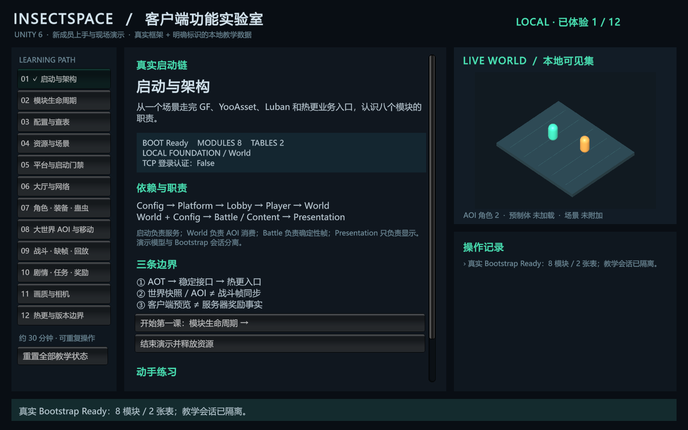

# Unity 6 客户端功能实验室

本地新人教学入口：`Assets/InsectSpace/Demos/ClientDemoHub.unity`。共 **12 个可交互主题**，建议讲解 30–40 分钟，再按模块分组练习。已有框架能力调用真实实现；尚无服务端的业务使用界面明确标注的 **LOCAL 教学夹具**。夹具是可重复的示例输入，不是账号、玩家、经济或服务器事实。



## 五分钟启动

1. 用 **Unity 6.6 / 6000.6.3f1** 打开 `client/unity/InsectSpaceClient`，等待导入和编译结束。不要用团结编辑器打开这个目录。
2. 在仓库根目录打开 PowerShell 7，确认 `unity status --format json` 能找到该工程，状态为 `ready`。
3. 保存当前场景并停止 Play，然后运行：

   ```powershell
   ./tools/Start-ClientDemo.ps1
   ```

4. 等终端出现 `CLIENT_DEMO_READY lessons=12`。脚本会聚焦 **Game** 并选择 **16:10 / 1440×900**；最大化 Game 窗口可便于投影讲解。
5. 左侧选择主题；中间是操作、练习和源码入口；右侧是实时 AOI 表现和最近操作记录。`✓` / “已体验”表示本轮执行过该页操作，不代表掌握程度或发布验收。

只打开不运行：`./tools/Start-ClientDemo.ps1 -OpenOnly`。已打开场景后可以手动 Play。用 `-KeepGameView` 保留原来的 Game 分辨率和窗口焦点。

脚本通过 Unity CLI 在连接中的 Editor 创建或打开场景，编译检查后等待真实 Bootstrap 和 Demo Ready。它会清除 `EditorSceneManager.playModeStartScene` 的 Bootstrap 固定覆盖，让 Play 运行当前 Demo；不会把 Demo 加入 Player 发布场景，也不会改启动 JSON。菜单 `InsectSpace > Foundation > Open Bootstrap Scene` 可回到普通底座。

必须保留显式本地配置：`editorSimulate=true`、`localSmokeMode=true`、`useWeChatSdk=false`。配置不满足或启动失败时会显示错误，不自动降级或伪造成功。

## 逐课讲解与预期结果

下表源码路径相对 `client/unity/InsectSpaceClient/Assets/InsectSpace/`；每页“在编辑器中打开本页源码”可直接定位。

| 课题 / 建议时长 | 现场操作顺序 | 应观察到的结果 | 实现与阅读入口 |
| --- | --- | --- | --- |
| 01 启动与架构 / 2 分钟 | 读取 Ready、模块/表数量与身份状态 | 真实 GF / YooAsset / Luban / 热更入口；8 模块、2 表；TCP 未认证 | `HotUpdate/HotUpdateEntry.cs`；`docs/Architecture.md` |
| 02 模块生命周期 / 3 分钟 | 运行正常排序，再注入 view.Start 失败 | config → data → view 启动；逆序 Stop；失败模块也清理；服务表冻结 | `HotUpdate/Modules/Presentation/Demo/DemoModuleLesson.cs` |
| 03 配置与查表 / 2 分钟 | 按场景名称筛选，再重新解析 bytes | 真实 Core 表数据；未知关键字显示无匹配；画质预算来自 Luban | `HotUpdate/Config/Generated/Tables.cs`；`design/luban`；`tools/Build-Tables.ps1` |
| 04 资源与场景 / 4 分钟 | 加载 WorldActor → 释放；附加 WorldSandbox → 卸载；重复三轮 | 真正的 YooAsset handle；先销毁实例，再 Release；卸载后 scene handle 失效 | `HotUpdate/Modules/Presentation/Demo/ClientDemoHub.cs`；`docs/Resource-Ownership.md` |
| 05 平台与启动门禁 / 2 分钟 | 点击缺少包名、未安装小游戏网络工厂两个案例 | 两条真实校验路径明确拒绝；不修改当前启动配置 | `Runtime/Boot/BootConfiguration.cs`；`docs/WeChat-Release-Gates.md` |
| 06 大厅与网络 / 4 分钟 | 依次模拟身份、准入、断线、重新认证；然后执行 TCP 诊断 | 独立教学会话 SignedOut → Lobby → World → Recovering → World，新 Epoch；TCP 成功仍未认证 | `HotUpdate/Modules/Lobby/Demo/LocalNetworkProbe.cs`；`docs/Session-Lifecycle.md` |
| 07 角色 / 装备 / 蛊虫 / 2 分钟 | 应用下一版角色快照；重送 Revision 1；切换两套预览 | 旧快照拒绝；预览不改变 Revision；教学 ID 不冒充生成表 | `HotUpdate/Modules/Player/Demo/LocalPlayerLesson.cs` |
| 08 大世界 AOI 与移动 / 4 分钟 | 进入两角色 → 移除同伴 → 换外观；发送移动 → 夹具确认；换线 → 投递旧 Epoch | 真正的 AOI 消费与插值；确认前角色不动；新路由清空可见集；旧快照 false；HomeRealm 不变 | `HotUpdate/Modules/World/Demo/LocalWorldLesson.cs`；`WorldPresenceStore.cs`；`docs/World-Client.md` |
| 09 战斗 / 缺帧 / 回放 / 4 分钟 | 本地单步/慢放并回放；重置缺帧示例，先送未来帧，尝试推进，再补当前帧 | HP 与 hash 确实变化；缺帧时帧号与 hash 不变；补齐后有序推进；逐帧 hash 一致 | `HotUpdate/Modules/Battle/Demo/DemoBattleLab.cs`；真实 `BattleSession` 与 GF 确定性世界 |
| 10 剧情 / 任务 / 奖励 / 3 分钟 | 交谈 → 探访 → 练习 → 提交 → LOCAL 回执；再次确认 | 提交时计数仍 0；首次回执变 1；重复回执 false，保持 1；可重置 | `HotUpdate/Modules/Content/Demo/LocalQuestLesson.cs` |
| 11 画质与相机 / 2 分钟 | 切换低/中/高档；拖动相机视野，再恢复 | 实际 URP 管线与目标 FPS 改变；相机只改变显示 | `Rendering/QualityController.cs`；`docs/Rendering.md` |
| 12 热更与版本边界 / 3 分钟 | 点击程序集/目标检查 | AOT → Gameplay 直接引用 false；当前目标匹配 true；Android 对 WindowsEditor false | `Runtime/HotUpdate/HotUpdateLoader.cs`；`docs/Hot-Update.md`；`docs/Native-Validation.md` |

“LOCAL 权威夹具确认”只是人为投递一条服务器式响应，客户端没有获得生产路由或奖励决定权。大世界 AOI 快照与战斗有序帧是两个独立机制，HomeRealm、世界实例、战斗房间也不能混用。

## 网络课：两次都要演示

在另一个终端运行：

```powershell
./tools/Run-LocalServer.ps1
```

点击第 06 页“连接本机并发送 foundation.hello”。仅访问 `127.0.0.1:7777`，收到 `foundation.ready` 后显示真实 TCP 往返成功，但诊断会话仍是 `SignedOut / 未认证`。它不登录账号，也不会申请在线战斗票据。

用 Ctrl+C 停止这个诊断主机，再次点击连接。应显示连接失败，并保留未认证状态；不会转为本地登录。与真实服务协同时不要启动第二个占用相同端口的主机。

KCP 传输与票据的真实回环验证由 `tools/Test-Foundation.ps1` 覆盖；第 09 页通过本地有序收件箱演示网络帧边界，**并未连接在线 KCP 战斗房间**。

## 重复讲解与释放

- “重置全部教学状态”：先释放当前 prefab 和附加场景，再重置角色、任务、会话、AOI、战斗、相机和体验进度；真实 Bootstrap 保持运行。
- 第 01 页“结束演示并释放资源”：卸载资源和场景，释放诊断连接，销毁 Demo 自己创建的 Bootstrap；随后停止 Play。若借用了已有 Bootstrap，不销毁该外部实例。
- 直接停止 Play 由 Unity 结束会话；运行中单独销毁 Hub 时有独立清理协程，等待附加场景卸载后才释放其拥有的 Bootstrap。
- 结束时恢复进入 Demo 前的画质、目标 FPS、VSync、相机目标和视野。教学运行不保存玩家或奖励数据。

## 新成员动手路线

1. 所有人先读 `README.md`、`docs/Architecture.md`、`docs/Team-Ownership.md`，再在自己组的模块目录工作。
2. World 组：为 LOCAL 快照增加一个可见角色，观察同 ID 的更新、离开与外观替换；用已有契约接入，不改共享 DTO。
3. Battle 组：只用整数/FP64 改动教学伤害规则，验证两种输入顺序和回放仍一致。禁止把 Unity 物理、帧率、系统时间或随机数混入权威计算。
4. Player / Content 组：增加一个本地预览字段或原创教学条件；继续保持 Revision 和回执幂等边界，不让 UI 发放奖励。
5. Presentation 组：改进操作提示、数据展示和可访问性；所有玩法状态仍来自所属模块。
6. 配置学习：修改 `design/luban` 源后导表；不要手改 Generated C# 或 `.bytes`。公共协议、Runtime、Editor、shared 和 SDK 变更先走平台评审。

## 自动检查与证据

保存场景、停止 Play，在当前 Unity 6 Editor 运行：

```powershell
./tools/Test-ClientDemo.ps1                              # 当前 InsectSpace EditMode + PlayMode
./tools/Test-ClientDemo.ps1 -Mode PlayMode -Filter ClientDemoTests
./tools/Test-Foundation.ps1
./tools/Test-Architecture.ps1
./tools/Test-ClientEnvironment.ps1
```

Unity CLI 测试脚本会暂时清除每轮测试的 Play 场景覆盖，完成后恢复之前的已保存场景与覆盖设置。尚未保存的场景会被拒绝，不替用户保存或丢弃。编译、启动和两组测试证据写入 `.artifacts/validation/client-demo/`。若使用筛选运行，输出仅证明该筛选范围；以 JSON 的实际 summary 为准。

Demo 测试覆盖模块回滚、角色快照防御性复制、任务顺序/重复回执、AOI 移动确认/过期 Epoch、战斗缺帧/乱序/hash 回放、12 页初始化、资源多次加载释放、失败操作不计进度、带资源重置/结束和销毁后重启。网络测试在真实 Bootstrap 旁启动独立回环 TCP 服务，验证重复诊断连接不重复注册传输、不改变主会话，停服后保持失败与未认证。

## 常见问题

| 现象 | 排查 |
| --- | --- |
| CLI 找不到工程 | 确认 Unity 6 工程已打开、Pipeline 已导入、编译无错；`unity status --format json` 检查具体 project 路径。 |
| 打开了 Demo 却运行 Bootstrap | 再运行启动脚本清除 Play 起始场景覆盖；仅双击 Demo 不能覆盖之前固定的 Bootstrap。 |
| 测试停在普通 Bootstrap，没有结果 | 使用 `Test-ClientDemo.ps1`；它在每轮测试前清除覆盖，包含 EditMode 设置测试重新固定 Bootstrap 的情况。 |
| 启动失败或超时 | 读取 Game 中的错误与 Console；检查明确的 LOCAL 配置、包名和 Collector。不要修改为“失败也成功”。 |
| 没有在线玩家、装备或任务数据 | 当前这些都是明确的 LOCAL 教学数据；生产服务尚未接入。 |
| 资源页出现错误 | 先读取操作记录；检查 `WorldCommon/WorldActor`、`WorldSandbox` 地址和 Core 绑定版本；失败操作不会标记体验完成。 |
| Game 内容太小 | 使用 16:10 / 1440×900 并最大化 Game 页签；场景由运行中的 Unity Editor 渲染。 |

## 验证范围

本入口面向 **Unity Editor 本地教学**。真实初始化与 EditorSimulate 资源操作不等于 CDN 下载验收，Editor 已编译 Gameplay 不等于 HybridCLR 原生热更，TCP 诊断不等于身份认证。当前没有完整背包/经济系统、生产技能、真实 MMO/AOI 服务、好友路由器或微信设备验证。具体执行记录见 `docs/Validation.md`，发布仍须满足 `docs/WeChat-Release-Gates.md`。
