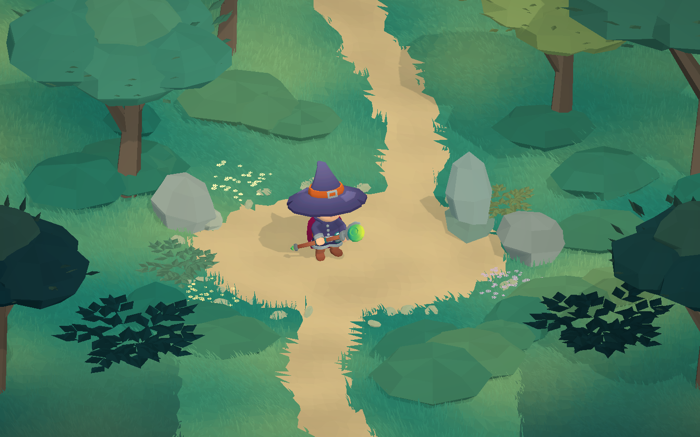

# Unity 6 草地渲染样板

2026-10-02，Unity **6000.6.3f1** / Unity CLI **1.0.0-beta.11** / Pipeline **0.8.0-exp.1**。场景位于 Unity 工程的 `Assets/InsectSpace/Scenes/MeadowShowcase.unity`，是独立的 **LOCAL RENDER STUDY**：角色动画、程序化植被、材质和构图研究。

## 预览与启动



上图由运行中的 `Showcase Camera` 以 **1440×900** 捕获。低、中、高三档及六边形覆盖层截图分别为 `Assets/Screenshots/Meadow_Quality_0.png`、`Meadow_Quality_1.png`、`Meadow_Quality_2.png` 和 `Meadow_Tactical.png`。

先用上述 Unity 版本打开 `client/unity/InsectSpaceClient`，保存当前场景并停止 Play；在仓库根目录使用 PowerShell 7：

```powershell
./tools/Start-MeadowShowcase.ps1                  # 高画质，进入 Play，保持预览
./tools/Start-MeadowShowcase.ps1 -Quality 0       # 低画质草量
./tools/Start-MeadowShowcase.ps1 -TacticalGrid    # 显示构图用六边形网格
./tools/Start-MeadowShowcase.ps1 -OpenOnly        # 仅打开，不开始 Play
```

每次重新运行启动命令前应停止当前 Play。脚本拒绝覆盖未保存场景，将 Editor 本地 `playModeStartScene` 指向此样板，避免 Foundation 的 Bootstrap 起始场景覆盖。成功时输出 `MEADOW_SHOWCASE_READY`，在 Unity 的 Game 标签查看动态画面。回到基础流程时使用 `InsectSpace > Foundation > Open Bootstrap Scene`；此样板不登录、不连接世界、不运行权威战斗。

## 视觉依据与素材

参考游戏为《剑与远征：启程》（AFK Journey）。实际查看了 [GameTyrant 的游戏评测](https://gametyrant.com/news/afk-journey-review-a-little-more-than-just-idle)内的实机画面，包括 Igor 角色与草地背景；用户提供的战斗截图用于观察赭黄空地、青绿色草坪和深色前景植被。Google Play 页面中的宣传合成图不作为已核实的纯实机截图。版权截图只作参考，没有复制到项目资产或仓库。

`docs/参考/webwxgetvideo.mp4` 当前为 **0 字节**，无法读取；本次没有把它算作已分析的视频。色彩和构图依据可读截图，当前模型的比例和细节仍不同于原游戏的商业美术。

角色改为 Kay Lousberg 的 **KayKit Adventures Mage**，许可证 **CC0-1.0**。紫色法师帽、披风与法杖比早期滑板角色更适合奇幻场景。

- 来源：[KayKit-Character-Pack-Adventures-1.0](https://github.com/KayKit-Game-Assets/KayKit-Character-Pack-Adventures-1.0)。
- 固定提交：`672074b73ba276876a19e8816ecdc5241817ab47`。
- 本地：`Assets/InsectSpace/Rendering/Showcase/KayKitAdventurers/`，包含 `Mage.fbx`、`mage_texture.png`、`staff.fbx`、`LICENSE.txt` 和记录 SHA256 的 `source.json`。
- 使用 Mage FBX 自带骨骼和 `2H_Melee_Idle`，生成循环的 `MageIdle.anim` 与控制器；Animator 开启、Root Motion 关闭。画面中的法杖来自 Mage 模型，独立 `staff.fbx` 未另外实例化。
- 原 Kenney 方案曾出现异常蒙皮 bounds，现已被替换；未将未经充分验证的根节点位移解释视为定论。旧资源和 `ShowcaseMotion` 不参与当前样板渲染。

## 场景实现

保留现有 URP 三档管线资源，新增 `InsectSpace/Meadow Painterly` shader：顶点调色、角色贴图、冷色阴影、简化明暗分带、双面草叶与风偏移，包含 ShadowCaster / DepthOnly pass。代码与生成资产均在渲染目录，不向确定性模拟写入浮点数、时间或随机状态。

`AgentScripts/RebuildMeadow.cs` 使用固定种子 **42017** 在 Editor 生成并持久化地面、弯曲小径、草叶、树冠、灌木、蕨叶、岩石、路标与花簇。草坪底色和草叶使用同一调色体系，路径和角色空地留白，深色前景形成遮挡层次。每根草为 **5 个顶点、3 个三角形**，合并到 **36 个空间块**，没有为每根草创建 GameObject。

`MeadowGrassLod` 监听 Unity 画质索引，仅在索引变化时切换预生成网格；三档共用空间分块。它是画质密度切换，不是按相机距离的动态 LOD。

| 画质 | 草叶数 | 草地三角形 | MeshFilter 三角形合计 |
| --- | ---: | ---: | ---: |
| Performant / 0 | 11,639 | 34,917 | 70,909 |
| Balanced / 1 | 23,278 | 69,834 | 105,826 |
| High Fidelity / 2 | 34,917 | 104,751 | 140,743 |

合计只统计启用对象的 MeshFilter，不包含角色 SkinnedMeshRenderer，不等于完整帧 GPU 工作量。六边形覆盖层默认关闭，仅用于构图预览，没有战斗规则或寻路含义。

相机固定正交，位置 `(0, 11.1, -15.5)`，看向 `(0, 0.55, 1.4)`，`orthographicSize=5.1`。当前场景不挂 `IsometricCameraRig`，避免跟随脚本改写构图。色调与后处理资产位于 `Assets/InsectSpace/Rendering/Showcase/Painterly/MeadowGrade.asset`。

## 重建与维护

当前唯一重建入口是 `AgentScripts/RebuildMeadow.cs`。早期 `BuildShowcase.cs`、`IntegrateKenney.cs`、`PolishShowcase.cs` 和 `AddTacticalGrid.cs` 是探索记录，不应用于重建当前场景。

重建会替换 MeadowShowcase 的对象和生成资产内容；先保存场景和需要保留的手工调整。脚本仅接受已保存、未处于 Play 的 MeadowShowcase，通过 Unity API 写资产，不手工编辑 YAML。

```powershell
./tools/Start-MeadowShowcase.ps1 -OpenOnly
$project = [IO.Path]::GetFullPath('client/unity/InsectSpaceClient')
$script = [IO.Path]::GetFullPath('AgentScripts/RebuildMeadow.cs')
unity command run_script --project-path $project --file $script --entry RebuildMeadow.Run --format json
```

生成资产保留原 GUID；网格更新显式写入顶点、索引、法线、UV、颜色和 bounds，再上传缓冲。避免仅用 `CopySerialized` 时出现旧 GPU 缓冲残留。顶点颜色转换为线性空间，避免草地与道路出现褪色或不一致。

## 验证

```powershell
./tools/Test-MeadowShowcase.ps1              # 专项 PlayMode 测试，并捕获四张预览
./tools/Test-MeadowShowcase.ps1 -CaptureOnly # 只切换画质并捕获，不运行测试
```

脚本要求已连接的 Unity 6 Editor，拒绝覆盖未保存场景。完成后停止 Play 并恢复调用前的画质；保持样板场景及其 Play 起始场景设置。截图仍需人工检查，数量检查不替代视觉验收。证据在 `.artifacts/validation/meadow-showcase/`。

本机 Direct3D11 已通过 Foundation **43/43**、Architecture、Unity EditMode **46/46**、PlayMode **19/19**；后者包含新增的三项场景专项测试，专项入口另行执行 **3/3**。测试覆盖重新加载后的持久化网格与材质、相机与 36 个草块、三档密度完整切换，以及真实骨骼运动、根位置和蒙皮 bounds。启动入口也已实测进入正确场景，Animator 时间持续推进。详细记录见 [Validation](Validation.md)。

这是可运行的本地美术研究样板；没有据此声称完成原游戏 UI、玩法、在线服务、移动端性能、微信设备或发布验收。
